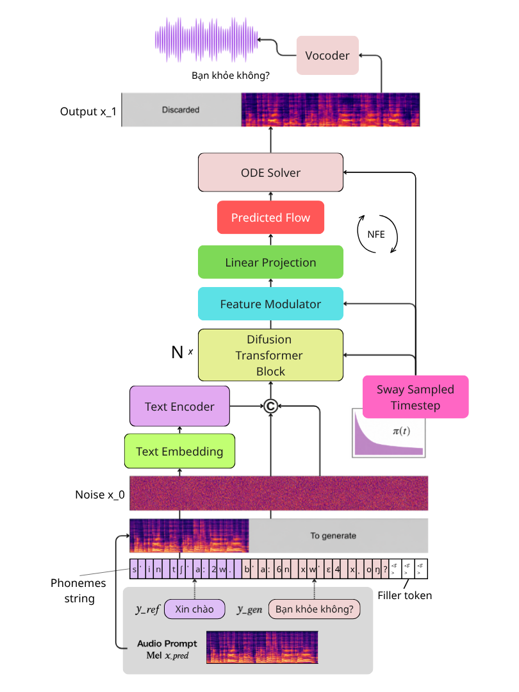
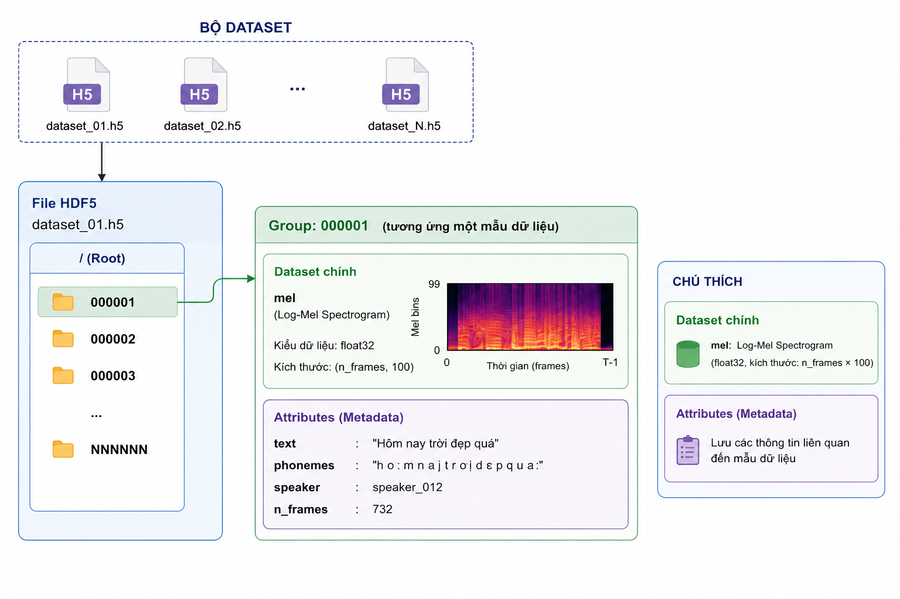

# Vietnamese Zero-shot Voice Cloning using F5-TTS and Optimal Transport Conditional Flow Matching


Official implementation accompanying the Bachelor's Thesis:

> **Research and Implementation of a Vietnamese Speech Synthesis Model for Voice Cloning based on Optimal Transport Conditional Flow Matching**

---

## Table of Contents

- Overview
- System Pipeline
- Repository Structure
- Requirements
- Getting Started
- Training Dataset
- Training
- Inference
- Evaluation
- Experimental Results
- Acknowledgements
- Citation
- License

---

## Overview

This repository presents a complete implementation of a **Vietnamese Zero-shot Voice Cloning** system built upon the **F5-TTS** architecture and **Optimal Transport Conditional Flow Matching (OT-CFM)**.

The project provides a complete training and inference pipeline for Vietnamese speech synthesis, including:

- Vietnamese text normalization
- Grapheme-to-Phoneme conversion using SeaG2P
- Audio preprocessing and Log-Mel Spectrogram extraction
- OT-CFM-based acoustic model training
- Voice cloning inference
- Objective evaluation using multiple speech quality metrics

### Main Features

- Vietnamese Zero-shot Voice Cloning
- F5-TTS acoustic model
- Diffusion Transformer (DiT) backbone
- Optimal Transport Conditional Flow Matching (OT-CFM)
- Euler and Heun ODE solvers
- Classifier-Free Guidance (CFG)
- BigVGAN neural vocoder
- Dynamic batching
- Mixed precision training
- Evaluation with WER, Speaker Similarity, UTMOS and RTF

---

## System Pipeline

<p align="center">

</p>

---

## Repository Structure

```text
ViFlow
├── .gitignore
├── LICENSE
├── README.md
│
├── configs.yaml              # Training & inference configuration
├── requirements.txt          # Python dependencies
│
├── dataset.py                # Dataset loading
├── dynamic_batching.py       # Dynamic batching
│
├── text_embedding.py         # Phoneme embedding
├── timestep_embedding.py     # Timestep embedding
├── dit_layers.py             # DiT building blocks
├── models.py                 # F5-TTS architecture
│
├── engine.py                 # OT-CFM ODE solver
├── trainer.py                # Training engine
├── train.py                  # Training script
├── inference.py              # Inference script
│
├── notebook_training.ipynb   # Interactive training notebook
└── notebook_inference.ipynb  # Interactive inference notebook
```

---

## Requirements

- Python ≥ 3.10
- PyTorch 2.x
- TorchAudio
- Librosa
- BigVGAN
- SeaG2P

---

## Getting Started

Clone the repository and install the required packages.

```bash
git clone https://github.com/huutrank4ds/ViFlow.git

cd ViFlow

pip install -r requirements.txt
```

Launch Jupyter Notebook

```bash
jupyter notebook
```

---

## Training Dataset

The training dataset is stored in the **HDF5** format for efficient large-scale data loading during model training.

Each HDF5 file contains multiple training samples, where every sample is organized as an individual **group** consisting of:

- Log-Mel Spectrogram
- Normalized text
- Phoneme sequence
- Speaker ID
- Number of Mel frames

The dataset organization is illustrated below.

<p align="center">

</p>

The complete preprocessed Vietnamese dataset is publicly available on Kaggle:

**Dataset:** [KAGGLE NOTEBOOK](https://www.kaggle.com/datasets/huuvahan/melspecviflow)

---

## Training

Model training is provided through the interactive notebook

```text
notebook_training.ipynb
```

The notebook includes:

- Dataset loading from HDF5
- Dynamic batching
- OT-CFM training objective
- Mixed precision training
- Exponential Moving Average (EMA)
- Checkpoint saving
- Training loss visualization

---

## Inference

Voice cloning inference is provided through

```text
notebook_inference.ipynb
```

The notebook demonstrates:

- Loading trained checkpoints
- Reference speech loading
- Text normalization
- Grapheme-to-Phoneme conversion
- Mel Spectrogram generation
- Waveform reconstruction using BigVGAN

Supported ODE solvers:

- Euler
- Heun

Supported Classifier-Free Guidance:

- Adjustable CFG Scale

---

## Evaluation

Objective evaluation is performed using:

- Word Error Rate (WER)
- Speaker Similarity
- UTMOS
- Real-Time Factor (RTF)

---

## Experimental Results

Performance on the Vietnamese test set.

| Metric | Value |
|---------|------:|
| WER | **9.70** |
| Speaker Similarity | **0.64** |
| UTMOS | **2.40** |
| RTF | **2.66** |

---

## Acknowledgements

This project is inspired by and builds upon several excellent open-source projects:

- F5-TTS
- Flow Matching
- DiT
- BigVGAN
- SeaG2P

We sincerely thank the authors for making their work publicly available.

---

## License

This project is licensed under the **Apache License 2.0**.

See the [LICENSE](LICENSE) file for details.